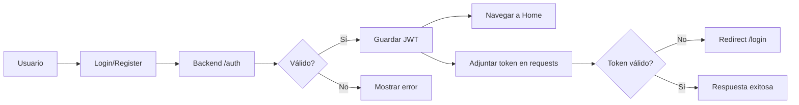

# TuDestino Mobile App 📱✨

**Aplicación móvil completa de TuDestino para iOS y Android** construida con Flutter - Réplica funcional de la aplicación web.

## 🌟 Características Implementadas

### ✅ Autenticación Completa
- **Login**: Inicio de sesión con email y contraseña
- **Registro**: Creación de cuenta (Viajero o Anfitrión)
- **Sesión persistente**: Token JWT almacenado de forma segura
- **Logout**: Cierre de sesión con confirmación

### 🏠 Búsqueda y Exploración de Propiedades
- **Pantalla de inicio**: Propiedades destacadas con imágenes
- **Búsqueda avanzada**: Por ubicación, fechas, número de huéspedes
- **Filtros avanzados**:
  - Rango de precios (slider)
  - Tipo de alojamiento (apartment, house, villa, hotel, room)
  - Selección de fechas con calendario
  - Contador de adultos y niños
- **Tarjetas de propiedad**: Imágenes, ratings, precios por noche
- **PropertyDetailScreen completa**:
  - Galería de imágenes deslizables
  - Descripción completa
  - Amenidades y servicios
  - Horarios de check-in/check-out
  - Selector de fechas integrado
  - Selector de habitaciones
  - Sistema de reserva completo
  - Cálculo automático de precio total

### 📅 Sistema de Reservas
- **Mis Reservas**: Lista con tabs (Próximas / Pasadas)
- **Estados de reserva**: Pendiente, Confirmada, Cancelada, Completada
- **Cancelación**: Opción para cancelar reservas con motivo
- **Detalles completos**:
  - Fechas de check-in/check-out
  - Número de huéspedes
  - Número de noches
  - Precio total
  - Información de la propiedad
- **Navegación**: Link directo a detalle de propiedad

### 📱 Red Social (Instagram/TikTok Style)
- **FeedScreen**:
  - Timeline de posts al estilo Instagram
  - Scroll infinito con paginación
  - Pull-to-refresh
  - Carrusel de imágenes por post
  - Botones de like, comentar, compartir
  - Double-tap para dar like
  - Contador de likes y comentarios
  - Información de usuario y tiempo
- **CommentsScreen**:
  - Lista de comentarios con avatares
  - Campo para añadir comentarios
  - Formato de burbujas de chat
  - Timeago relativo
- **Interacciones**:
  - Toggle de likes en tiempo real
  - Sistema de comentarios funcional
  - Eliminar posts propios
- **Notificaciones**: Screen con lista de notificaciones categorizada

### 👤 Perfil de Usuario
- **Información del usuario**:
  - Avatar circular
  - Nombre, email, rol
  - Badge de rol (Viajero/Anfitrión/Admin)
- **Estadísticas de anfitrión**: Rating y número de reseñas
- **Menú de opciones**:
  - Mis Reservas
  - Favoritos
  - Mis Propiedades (para anfitriones)
  - Notificaciones
  - Ayuda y Soporte
  - Cerrar Sesión
- **Confirmación**: Dialog para acciones importantes

### ❤️ Favoritos
- **FavoritesScreen**: Pantalla de propiedades guardadas
- **Estado vacío**: Mensaje cuando no hay favoritos
- **Link a búsqueda**: Botón para explorar propiedades

### 🔔 Notificaciones
- **NotificationsScreen**: Lista de notificaciones
- **Tipos**: Reservas, likes, comentarios, promociones
- **Iconos categorizados**: Colores y símbolos por tipo
- **Timeago**: Tiempo relativo en español

### 🎨 UI/UX Profesional
- **Diseño Material**: Siguiendo las guías de Material Design 3
- **Tema personalizado**: Colores de marca TuDestino (#FF385C)
- **Navegación intuitiva**:
  - Bottom navigation bar con 5 tabs
  - Drawer navigation en perfil
  - Rutas nombradas y navegación segura
- **Componentes reutilizables**:
  - PropertyCard
  - PostCard
  - CommentTile
  - BookingCard
  - RoomCard
- **Imágenes cacheadas**: CachedNetworkImage para mejor rendimiento
- **Estados de carga**:
  - CircularProgressIndicator
  - Shimmer effects
  - Mensajes de error amigables
  - Pull-to-refresh en listas
- **Animaciones suaves**: Transiciones entre pantallas
- **Traducción 100% español**: Todos los textos en español

## 📂 Estructura Completa del Proyecto

```
lib/
├── core/
│   ├── services/
│   │   ├── api_service.dart         # Cliente HTTP con Dio + interceptors JWT
│   │   └── navigation_service.dart  # Gestión centralizada de rutas
│   └── theme/
│       └── app_theme.dart           # Tema personalizado TuDestino
│
├── models/
│   ├── user.dart                    # Modelo de Usuario
│   ├── property.dart                # Modelo de Propiedad con helpers
│   ├── room.dart                    # Modelo de Habitación y Bed
│   ├── booking.dart                 # Modelo de Reserva
│   └── social_post.dart             # Modelos: Post, Reel, Comment
│
├── providers/ (State Management con Provider)
│   ├── auth_provider.dart           # Autenticación y sesión
│   ├── properties_provider.dart     # Propiedades y búsqueda
│   ├── bookings_provider.dart       # Reservas CRUD
│   └── social_provider.dart         # Posts, Reels, Likes, Comments
│
├── modules/
│   ├── auth/
│   │   ├── login_screen.dart        # Pantalla de login con validación
│   │   └── register_screen.dart     # Registro con selector de rol
│   │
│   ├── home/
│   │   └── home_screen.dart         # Home con SliverAppBar y propiedades
│   │
│   ├── search/
│   │   └── search_screen.dart       # Búsqueda avanzada con filtros
│   │
│   ├── properties/
│   │   └── property_detail_screen.dart  # Detalle completo + reserva
│   │
│   ├── bookings/
│   │   └── bookings_screen.dart     # Lista de reservas con tabs
│   │
│   ├── social/
│   │   ├── feed_screen.dart         # Feed Instagram-style
│   │   └── comments_screen.dart     # Comentarios
│   │
│   ├── profile/
│   │   └── profile_screen.dart      # Perfil con stats y menú
│   │
│   ├── favorites/
│   │   └── favorites_screen.dart    # Propiedades favoritas
│   │
│   └── notifications/
│       └── notifications_screen.dart # Notificaciones
│
└── main.dart                        # Entry point con MultiProvider
```

## 🛠️ Tecnologías y Dependencias

### Core
- **Flutter SDK**: 3.0+
- **Dart SDK**: Latest
- **Provider**: ^6.1.1 - State management
- **get_it**: ^7.6.4 - Dependency injection

### Network & Data
- **Dio**: ^5.4.0 - HTTP client con interceptors
- **flutter_secure_storage**: ^9.0.0 - Almacenamiento seguro JWT
- **shared_preferences**: ^2.2.2 - Preferencias locales

### UI Components
- **cached_network_image**: ^3.3.1 - Caché de imágenes optimizado
- **google_fonts**: ^6.1.0 - Tipografías personalizadas
- **flutter_svg**: ^2.0.9 - Soporte SVG

### Utilities
- **intl**: ^0.19.0 - Internacionalización y formateo
- **timeago**: ^3.6.1 - Tiempo relativo en español

### Media (Para futuras features)
- **image_picker**: ^1.0.7 - Cámara y galería
- **google_maps_flutter**: ^2.5.3 - Mapas
- **geolocator**: ^11.0.0 - Geolocalización

## 🚀 Instalación y Configuración

### 1. Prerrequisitos

```bash
# Verificar Flutter
flutter doctor

# Requisitos:
✓ Flutter SDK 3.0+
✓ Android Studio / Xcode
✓ Dispositivo físico o emulador
✓ Backend TuDestino corriendo
```

### 2. Instalar Dependencias

```bash
cd apps/mobile
flutter pub get
```

### 3. Configurar API URL

Edita `lib/core/services/api_service.dart`:

```dart
static const String baseUrl = 'http://localhost:3000/api';

// Para dispositivo físico:
// static const String baseUrl = 'http://192.168.1.X:3000/api';
```

### 4. Ejecutar la App

```bash
# Listar dispositivos disponibles
flutter devices

# Ejecutar en Android
flutter run

# Ejecutar en iOS (solo macOS)
flutter run -d ios

# Ejecutar en modo release
flutter run --release
```

## 📱 Pantallas y Navegación

### Rutas Implementadas

| Ruta | Pantalla | Descripción | Auth Requerido |
|------|----------|-------------|----------------|
| `/` | HomeScreen | Inicio con propiedades destacadas | No |
| `/login` | LoginScreen | Inicio de sesión | No |
| `/register` | RegisterScreen | Registro de usuario | No |
| `/search` | SearchScreen | Búsqueda avanzada | No |
| `/property-detail` | PropertyDetailScreen | Detalle y reserva | No |
| `/feed` | FeedScreen | Feed social Instagram-style | Recomendado |
| `/profile` | ProfileScreen | Perfil de usuario | Sí |
| `/bookings` | BookingsScreen | Mis reservas | Sí |
| `/favorites` | FavoritesScreen | Propiedades favoritas | Sí |
| `/notifications` | NotificationsScreen | Notificaciones | Sí |
| `/create-post` | (Próximamente) | Crear publicación | Sí |

### Bottom Navigation Bar

```
┌────────┬────────┬────────┬──────────┬────────┐
│ Inicio │ Buscar │ Social │ Favoritos│ Perfil │
│   🏠   │   🔍   │   📷   │    ❤️    │   👤   │
└────────┴────────┴────────┴──────────┴────────┘
```

## 🔐 Flujo de Autenticación



## 📊 State Management

### Providers Implementados

1. **AuthProvider**
   - `login(email, password)` → bool
   - `register(name, email, password, role)` → bool
   - `logout()` → void
   - `loadUser()` → void
   - `initialize()` → void (auto-login)

2. **PropertiesProvider**
   - `loadFeaturedProperties()` → List<Property>
   - `searchProperties(filters)` → List<Property>
   - `loadPropertyDetail(id)` → Property

3. **BookingsProvider**
   - `loadUserBookings()` → List<Booking>
   - `createBooking(data)` → bool
   - `cancelBooking(id, reason)` → bool
   - `upcomingBookings` → List<Booking>
   - `pastBookings` → List<Booking>

4. **SocialProvider**
   - `loadFeed(refresh)` → List<Post>
   - `loadReels()` → List<Reel>
   - `toggleLikePost(id)` → bool
   - `addComment(type, id, text)` → bool
   - `loadComments(type, id)` → List<Comment>

## 🎨 Personalización del Tema

```dart
// lib/core/theme/app_theme.dart
static const Color primaryColor = Color(0xFFFF385C);  // Rosa TuDestino
static const Color secondaryColor = Color(0xFF00A699); // Verde turquesa
static const Color textPrimary = Color(0xFF222222);    // Negro suave
static const Color textSecondary = Color(0xFF717171);  // Gris
```

## 🧪 Testing y Debug

```bash
# Ejecutar tests
flutter test

# Ejecutar con logs
flutter run --verbose

# Ver logs en tiempo real
flutter logs

# Analizar código
flutter analyze

# DevTools
flutter pub global activate devtools
flutter pub global run devtools
```

## 📦 Build para Producción

### Android

```bash
# APK (para testing)
flutter build apk --release

# App Bundle (para Play Store)
flutter build appbundle --release

# Output: build/app/outputs/
```

### iOS

```bash
# Build iOS (solo macOS con Xcode)
flutter build ios --release

# Abrir en Xcode
open ios/Runner.xcworkspace
```

## 🔥 Características Destacadas

### PropertyDetailScreen
- ✅ Galería de imágenes con PageView
- ✅ Rating con badge destacado
- ✅ Descripción expandible
- ✅ Lista de amenidades con chips
- ✅ Selector de fechas con calendario
- ✅ Selector de huéspedes con contadores
- ✅ Lista de habitaciones seleccionable
- ✅ Cálculo automático de precio total
- ✅ Confirmación de reserva con resumen
- ✅ Navegación a reservas después de reservar

### FeedScreen (Social)
- ✅ Infinite scroll con paginación
- ✅ Pull-to-refresh
- ✅ Double-tap para like
- ✅ Carrusel de imágenes por post
- ✅ Comentarios en pantalla separada
- ✅ Eliminar posts propios
- ✅ Timeago en español
- ✅ Avatares de usuario
- ✅ Loading states

### BookingsScreen
- ✅ Tabs: Próximas / Pasadas
- ✅ Estados con colores
- ✅ Información completa de reserva
- ✅ Botón de cancelación
- ✅ Link a propiedad
- ✅ Pull-to-refresh

## 📝 Próximas Features

- [ ] **ReelsScreen** completo con video player
- [ ] **Crear Post/Reel** con cámara y galería (image_picker)
- [ ] **Chat en tiempo real** con Socket.io
- [ ] **Notificaciones Push** con Firebase
- [ ] **Mapa interactivo** con Google Maps
- [ ] **Gestión de propiedades** para anfitriones
- [ ] **Sistema de reviews** y calificaciones
- [ ] **Integración de pagos** (Stripe/PayPal)
- [ ] **Soporte multi-idioma** (i18n)
- [ ] **Modo offline** con caché local
- [ ] **Compartir en redes sociales**
- [ ] **Deep linking**

## 🐛 Troubleshooting

### Error de conexión a API

```dart
// Verificar que el backend esté corriendo
// Verificar la URL en api_service.dart
// Para emulador Android: http://10.0.2.2:3000/api
// Para dispositivo físico: http://TU_IP_LOCAL:3000/api
```

### Imágenes no cargan

```dart
// Verificar que las URLs sean accesibles
// Verificar permisos de internet en AndroidManifest.xml
// Limpiar caché: flutter clean && flutter pub get
```

### Token expirado

```dart
// El sistema auto-redirige a /login en 401
// Verificar JWT_SECRET en backend
// Verificar flutter_secure_storage funcionando
```

## 🤝 Contribución

Este proyecto es parte del monorepo TuDestino.

```bash
# Crear rama
git checkout -b feature/nueva-funcionalidad

# Commit
git commit -m "feat(mobile): añadir nueva funcionalidad"

# Push y PR
git push origin feature/nueva-funcionalidad
```

## 📄 Licencia

Proyecto TuDestino - Todos los derechos reservados

## 📞 Soporte

- 📧 Documentación completa en `/apps/mobile/`
- 🔧 Backend docs en `/apps/api/README.md`
- 🌐 Web docs en `/apps/web/README.md`
- 📱 Revisa `/CLAUDE.md` para guías de desarrollo

---

**✨ Aplicación móvil completa con todas las funcionalidades de la web implementadas en Flutter ✨**
